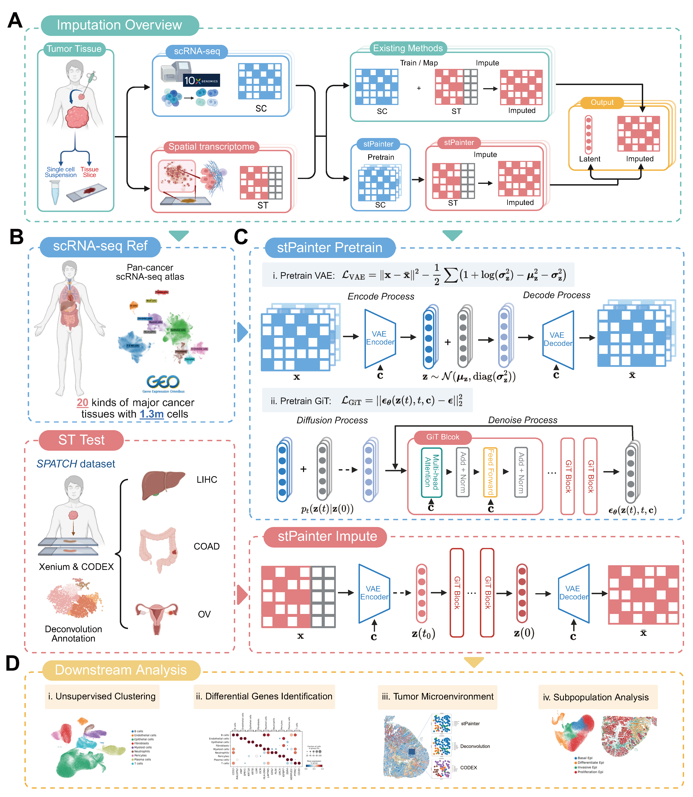

# stPainter

[](LICENSE)
[](https://www.python.org/)
[](https://pytorch.org/)
[](https://www.biorxiv.org/content/10.64898/2026.02.11.704553v1)

This repository contains the official implementation and tutorial for **stPainter**.

<!-- TOC -->
* [📖 Introduction](#-introduction)
* [🛠️ Environment Setup](#️-environment-setup)
* [📂 Data Preparation](#-data-preparation)
* [🚀 Getting Started](#-getting-started)
* [📓 Detailed Tutorial](#-detailed-tutorial)
* [🔥 Model Training](#-model-training)
* [🔗 Citation](#-citation)
* [✉️ Contact](#️-contact)
<!-- TOC -->

## 📖 Introduction

stPainter is a deep learning framework designed to universally enhance spatial transcriptomics (ST) data across diverse histological landscapes. Leveraging a latent diffusion model pretrained on massive pan-cancer scRNA-seq datasets, stPainter enables direct application to diverse tumors without retraining. Ultimately, it yields dual outputs for each cell: an enhanced latent embedding for tasks such as fine-celltype clustering, and an imputed gene matrix for differential expression analysis, significantly enhancing the utility of single-cell resolution ST.



## 🛠️ Environment Setup

We recommend using Miniconda or Anaconda to manage the environment.

### 1. Create the environment
```bash
conda create -n stpainter python=3.10 -y
conda activate stpainter
```

### 2. Install dependencies
Basic installation:
```bash
pip install -r requirements.txt
```

### 3. (Optional) Custom CUDA Installation
By default, the requirements file installs the standard version of PyTorch. If you require a specific CUDA version (e.g., **CUDA 12.6** for Flash Attention or specific GPU drivers), please install PyTorch manually:

```bash
# Example for CUDA 12.6
pip install torch==2.8.0 --index-url https://download.pytorch.org/whl/cu126
```

## 📂 Data Preparation

Data should be organized in the `data/` directory. You can either download the preprocessed data directly or process the raw data from scratch.

### Directory Structure

Ensure your project directory looks like this:

```text
stPainter/
└── data/
    ├── raw/              # Raw datasets (scRNA-seq & ST)
    │   ├── sc_raw.h5ad
    │   ├── st_CESC_raw.h5ad
    │   ├── st_COAD_raw.h5ad
    │   ├── st_LIHC_raw.h5ad
    │   ├── st_NSCLC_raw.h5ad
    │   ├── st_OV_raw.h5ad
    │   └── st_PRAD_raw.h5ad
    └── processed/        # Processed files for training/testing
        ├── gene_sparsity_ratio.csv
        ├── sc_train.h5ad
        ├── st_CESC_test.h5ad
        ├── st_COAD_test.h5ad
        ├── st_LIHC_test.h5ad
        ├── st_NSCLC_test.h5ad
        ├── st_OV_test.h5ad
        └── st_PRAD_test.h5ad
```

### Option 1: Use Processed Data (Recommended)

Download the preprocessed datasets directly to skip the data processing step.

1. [Download](https://drive.google.com/drive/folders/1ROePTWXUtuZWIrbLF6HLf34cRaLjGTCw?usp=share_link) the processed data and move the files into the `./data/processed/` directory.
2. Ensure `gene_sparsity_ratio.csv` and the `.h5ad` files are present as shown in the structure above.

### Option 2: Process from Scratch

If you prefer to process the raw data yourself:

1. Download([COAD, OV, LIHC](https://spatch.pku-genomics.org/), [PRAD](https://www.10xgenomics.com/datasets/xenium-prime-ffpe-human-prostate), [NSCLC](https://www.10xgenomics.com/datasets/xenium-human-lung-cancer-post-xenium-technote), and [CESC](https://www.10xgenomics.com/datasets/xenium-prime-ffpe-human-cervical-cancer)) the raw data and move the files into the `./data/raw/` directory.
2. Use the provided script to generate the training and testing files.

```bash
python process_data.py --raw_data_dir ./data/raw/ --processed_data_dir ./data/processed
```

## 🚀 Getting Started

This section guides you through using the pretrained stPainter models to impute gene expression and evaluate the results.

### 1. Download Pretrained Models

[Download](https://drive.google.com/drive/folders/1ROePTWXUtuZWIrbLF6HLf34cRaLjGTCw?usp=share_link) the pretrained model weights. After downloading, ensure the `checkpoint/` directory is organized as follows:

```text
stPainter/
└── checkpoint/
    ├── diffusion_50.ckpt
    ├── diffusion_100.ckpt
    ├── vae_50.ckpt
    └── vae_100.ckpt
```

**Note:** Before proceeding, ensure you have placed the model checkpoints in the `./checkpoint/` directory and prepared the data as described in [Data Preparation](#-data-preparation).

### 2. Gene Imputation

Use `impute_stPainter.py` to generate imputed gene expression matrices. The following example uses the model with a latent size of **50** on the COAD dataset.

```bash
python impute_stPainter.py \
    --diffusion_checkpoint checkpoint/diffusion_50.ckpt \
    --vae_checkpoint checkpoint/vae_50.ckpt \
    --latent_size 50 \
    --input_path ./data/processed/st_COAD_test.h5ad \
    --output_path ./data/imputed_50/st_COAD_imputed.h5ad \
    --cancer_type COAD
```

*Tip: To use the 100-dimensional model, simply change `--latent_size` to 100 and update the checkpoint paths accordingly.*

### 3. Testing & Evaluation

To evaluate the model's performance and generate metrics, run the test script:

```bash
python test_stPainter.py \
    --diffusion_checkpoint checkpoint/diffusion_50.ckpt \
    --vae_checkpoint checkpoint/vae_50.ckpt \
    --latent_size 50 \
    --input_path ./data/processed/st_COAD_test.h5ad \
    --result_dir ./test/stPainter_50 \
    --cancer_type COAD
```

## 📓 Detailed Tutorial
TODO

## 🔥 Model Training

If you wish to train stPainter from scratch (e.g., using a custom single-cell reference atlas), follow the two-stage training process outlined below.

**Note:** Ensure the `--latent_size` parameter is consistent across both steps (e.g., 50 or 100).

### Step 1: Pretrain VAE

First, train the Variational Autoencoder (VAE) to compress high-dimensional gene expression profiles into a compact latent space.

```bash
python train_vae.py \
    --data_path ./data/processed/sc_train.h5ad \
    --latent_size 50
```

### Step 2: Pretrain Diffusion Model

Next, train the Gene Diffusion Transformer (GiT) to learn the distribution of the VAE's latent representations.

**Note:** This step requires the VAE checkpoint generated in Step 1.

```bash
python train_diffusion.py \
    --vae_checkpoint ./checkpoint/vae_50.ckpt \
    --data_path ./data/processed/sc_train.h5ad \
    --latent_size 50
```

## 🔗 Citation

If you find this work useful in your research, please consider citing:

```bibtex
@article {Yang2026.02.11.704553,
	author = {Yang, Yuhang and Luo, Yiming and Zhang, Kai and Zhang, Zaixi and Peng, Haoxin and Cao, Chenlin and Liu, Qi and Ma, Bin and Chen, Yang and Shen, Lin and Chen, Enhong},
	title = {Enhancing Pan-cancer Spatial Transcriptomics at Single-cell Resolution with stPainter},
	year = {2026},
	doi = {10.64898/2026.02.11.704553},
	journal = {bioRxiv}
}
```

## ✉️ Contact

If you have any questions or encounter issues, please feel free to:
* Open an issue in this repository.
* Contact us via email: [yyh20030806@mail.ustc.edu.cn](mailto:yyh20030806@mail.ustc.edu.cn).
